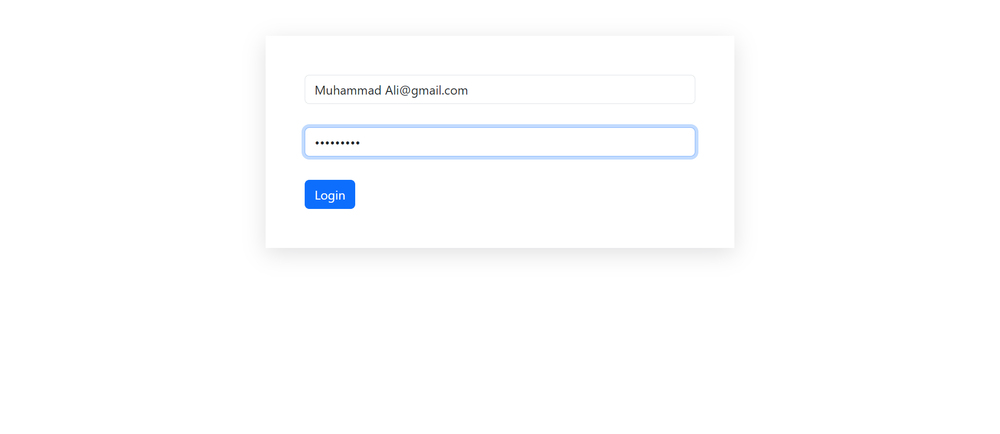
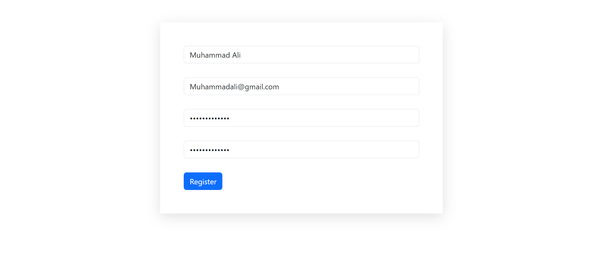

# Login and Registration Form with PHP

## Overview

This project provides a simple and secure login and registration system using PHP. The application allows users to register new accounts, log in with existing credentials, and manage their sessions.

## Features

- User registration with input validation.
- User login and session management.
- Password hashing for secure storage.
- Basic form validation and error handling.

## Requirements

- PHP 
- MySQL database
- Web server (e.g., Apache, Nginx)

## Installation

1. **Clone the Repository**

   ```bash
   git clone https://github.com/yourusername/your-repository.git
   ```
   ## File Structure
- index.php: Main page with login and registration forms.
- register.php: Handles user registration.
- login.php: Handles user login.
- database.sql: SQL schema for creating necessary tables (if applicable).


## Screenshots
**Login Form**



**Registration Form**



## Usage
**Register a New Account**

**Navigate to index.php**
Fill out the registration form with your details.
Submit the form to create a new account.

**Log In**
Use the login form on index.php.
Enter your credentials and submit to log in.

**Log Out**
Access logout.php to end your session and log out.
Security Considerations

## License
This project is open-source and available under the MIT License.
